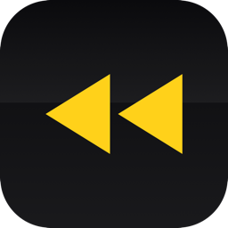
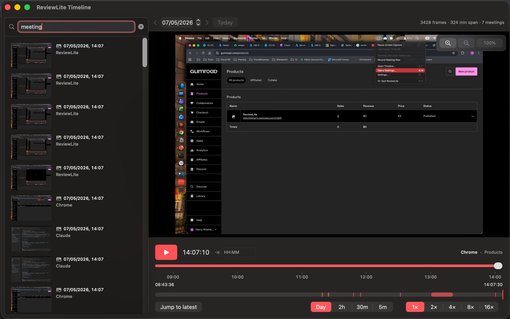
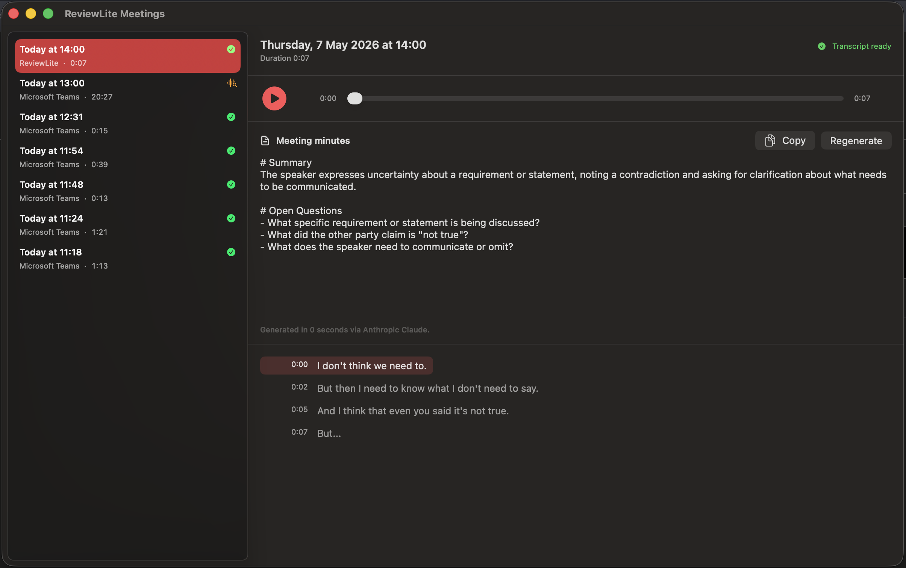
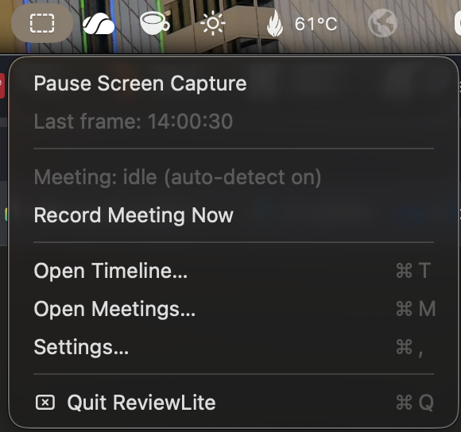
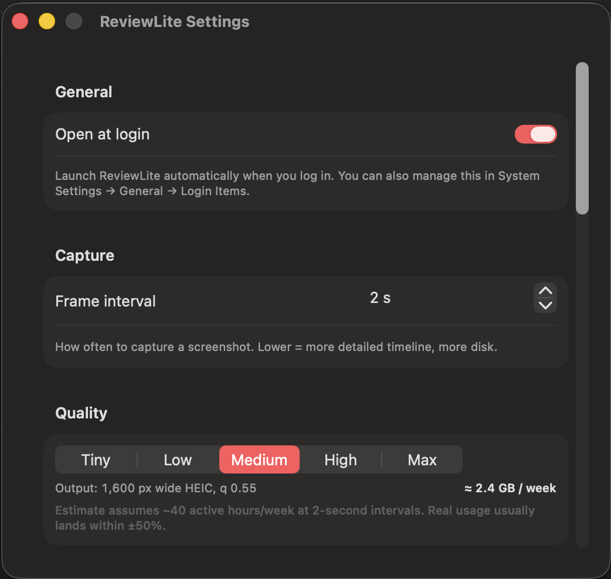

<p align="center">
  
</p>

<h1 align="center">ReviewLite</h1>

A local-first scrollback for your Mac screen — and an automatic recap of every
meeting you take. Captures periodic screenshots, OCRs them so you can search what
you saw, and silently records local audio + transcripts of meetings (Zoom, Teams,
Slack huddles, FaceTime, Discord, Webex) so you can re-listen and read back what
was said.

Everything runs on-device. Nothing is uploaded.

> **[Download ReviewLite for €5 →](https://attentiveharry.gumroad.com/l/tsbff)**
>
> Apple Silicon · macOS 14 (Sonoma) or later · one-time purchase, no subscription
>
> _If you'd rather build it yourself from source, the code is right here under MIT — see [Building from source](#building-from-source) below._



---

## Install

After purchase you'll receive a `.dmg` by email. Open it and drag `ReviewLite.app`
into `/Applications`. Then:

1. **First launch only:** right-click `ReviewLite.app` → **Open** → confirm.
   (The app is signed locally rather than with a paid Apple Developer ID, so
   macOS asks you to confirm once. Subsequent launches just work.)
2. Grant **Screen Recording** and **Microphone** permission when prompted.

That's it. The icon lives in the menu bar.

If your Mac is locked down with strict Gatekeeper rules and step 1 still won't
open, run this in Terminal once:

```
xattr -d com.apple.quarantine /Applications/ReviewLite.app
```

## What it does

- **Scrubbable timeline** — a per-day view of your screen. Click play and frames
  scroll forward in real time; if you cross a recorded meeting, the audio plays
  back in sync. Zoom levels (whole-day · 2 h · 30 m · 5 m) plus a "go to time"
  field so you can land precisely.
- **Unified search** — every captured frame is OCR'd via Apple's Vision
  framework. Type a phrase you remember, see a list of moments where it
  appeared on screen *or* was said in a meeting. Click a hit to jump there.
- **Automatic meeting recording** — when ReviewLite detects an active call
  (Zoom, Teams, Slack huddle, FaceTime, Discord, Webex), it records mic + system
  audio silently in the background and runs a local Whisper transcription
  afterwards. No notification, no banner, no permission per call. Detection is
  per-process mic activity, not window-title guesswork — so it doesn't false-fire
  on idle Teams chats.
- **Echo-aware** — when you're on built-in laptop speakers, ReviewLite records
  mic only (the mic already captures everything coming out of the speakers, so
  capturing system audio separately would double the meeting voices). On
  headphones, both streams are mixed cleanly.
- **Multi-display aware** — captures whichever screen your active window is on.
  Move a Zoom call to your external monitor and capture follows.
- **AI meeting minutes (optional)** — bring your own Anthropic Claude or
  OpenAI ChatGPT API key in Settings. One click on any meeting generates
  structured minutes: Summary, Key Points, Decisions / Conclusions, Action
  Items, Open Questions. Copy to clipboard, paste into your notes.



<p align="center">
  
</p>

## Privacy

- All screen frames, audio recordings, and transcripts live in the app's sandbox
  container at `~/Library/Containers/com.reviewlite.app/Data/...`. Nothing leaves
  your Mac.
- One exception: WhisperKit downloads its speech model from Hugging Face once
  on first transcription (~140 MB).
- One opt-in exception: if you set an AI API key, transcript text is sent over
  HTTPS to your chosen provider only when you click "Generate minutes" — never
  audio, never frames.
- Old data is automatically deleted after the retention window you set in
  Settings (default 30 days), including frames, OCR text, audio, transcripts,
  and AI-generated minutes. Orphan files on disk get swept too.
- **Recording meetings is your responsibility.** In many jurisdictions you must
  inform participants. Use accordingly.

## Configuration

Menu bar icon → Settings:

- **Open at login** (toggle)
- **Frame interval** (1–30 s, default 3 s)
- **Capture quality** (5 presets, with a live disk-usage estimate)
- **Excluded apps** — frames captured while these apps are frontmost are skipped.
  Defaults: `com.apple.loginwindow`, `com.apple.ScreenSaverEngine`. Add any app
  whose screens you don't want recorded (banking, password managers, etc).
- **Retention** (1–365 days, default 30)
- **AI summary** — provider picker + API key field (key stored in the app's
  sandboxed preferences, never transmitted anywhere except to your chosen
  provider when you click Generate).



## Known limits

- Apple Silicon only.
- Browser-based meetings (Google Meet in Chrome / Safari) aren't auto-detected
  by the meeting monitor; use the "Record Meeting Now" menu item for those.
- Speech transcript is one stream — no speaker diarization yet.
- Default Whisper model is English-only (`openai_whisper-base.en`); change
  `modelName` in `Sources/Meetings/Transcriber.swift` for multilingual.

---

## Building from source

The full source is right here under the MIT licence. If you'd prefer to build
your own copy instead of buying the DMG, you can.

Requires Xcode 16+ and `xcodegen` (`brew install xcodegen`).

```bash
git clone https://github.com/hjatte/ReviewLite
cd ReviewLite
xcodegen generate
xcodebuild -project ReviewLite.xcodeproj -scheme ReviewLite -configuration Release build
```

The built app lands in
`~/Library/Developer/Xcode/DerivedData/ReviewLite-…/Build/Products/Release/ReviewLite.app`.

For distributing your own builds beyond a single Mac, you'd need an Apple
Developer ID (US$99/year) and would change `CODE_SIGN_IDENTITY` in the Release
config of `project.yml`.

## Architecture (short version)

```
ReviewLite/
├── App.swift                      # @main + AppDelegate
├── Logging.swift                  # os.Logger subsystems
├── MenuBar/MenuBarController.swift
├── Capture/                       # ScreenCaptureKit + Vision OCR + window tracking
├── Meetings/                      # Detection, audio capture, WhisperKit, AI minutes
├── Storage/                       # SQLite + FTS5 + retention
├── Settings/                      # UserDefaults preferences + capture quality presets
├── AISummary/                     # Anthropic + OpenAI clients for meeting minutes
├── Permissions/                   # Screen Recording / Mic prompt helpers
├── UI/                            # SwiftUI views: Timeline, Meetings, Search, Settings
└── Resources/                     # Info.plist, entitlements, AppIcon.icns
```

## Contributing & support

This is a personal project I maintain in my spare time. PRs welcome but no SLA
on response times. File an issue if something's broken; I'll get to it when I
can.

## Licence

MIT. See [LICENSE](LICENSE).

This project is not affiliated with Rewind AI. It's an independent personal
tool inspired by the same use case.
